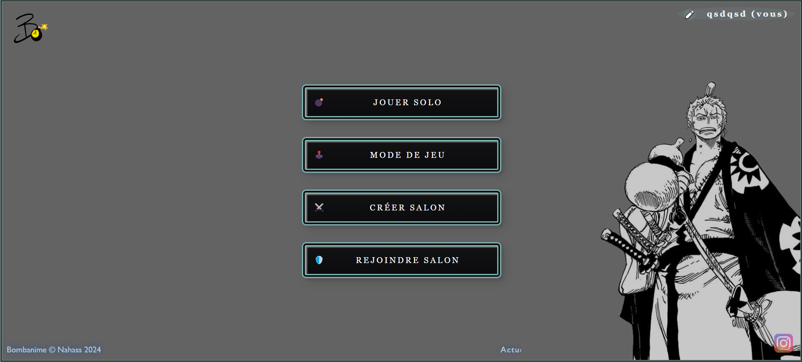
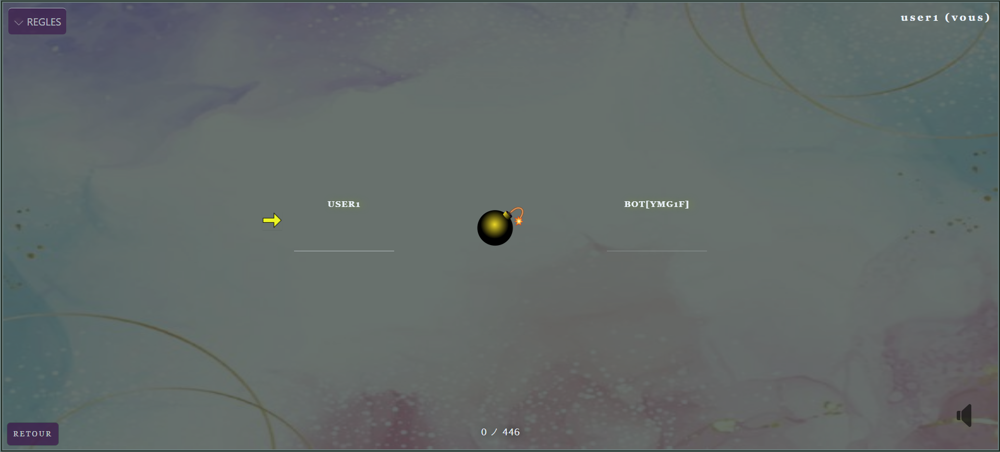

# BOMBANIME
> Bombparty like | Anime version , multigames and multiplayer

Basé sur le jeu Bomparty disponible sur le site de https://jklm.fun/ , le jeu propose divers mini jeux de plateau (jeu de la bombe et jeu de carte) sur le thèmes des anime/mangas concu pour les fan du milieu. D'autres sont en cours de développement.

## FONCTIONNALITÉS / FONCTIONNEMENT

- Pas d'inscription ou de connexion requise pour jouer (seulement choix de pseudo)
- Choix du mode de jeu et possibilité de jouer en solo ou en multijoueur
- Création de salon à code pouvant accueillir jusqu'à 10 joueurs
- Paramètres proposant un changement du thème personnel du site (fond , musiques , etc...) possible pour la session active

## MODES DE JEU

- **Bombanime** : jeu de la bombe (l'hôte choisit  une série et ajuste les paramètres de jeu puis chaque joueur envoie à tour de rôle un personnage provenant de la série en question dans le temps imparti.
> EN SOLO CONTRE UN BOT

> DE 2 A 10 JOUEURS

- **Trivianime** : jeu de quiz multijoueur à points , choix de mode de difficulté (progressif ou aléatoire , choix de thème (série sur laquelle porte les questions) , choix du nombres de questions et du temps

> CHOIX DES PARAMETRES

> DEROULEMENT DU QUIZ A POINTS (MULTIJOUEUR)

## TECHNOLOGIES / TECH
Les différentes technologies utilisés pour le bon fonctionnement de l'application
- [Vue.js] 
- [Bootstrap]
- [JQuery] 
- [node.js]
- [Express] 
- [socket.io] 

## ACCESS (hébergement HRK)
https://guesswhoanime-c6d6aff929fc.herokuapp.com/

## License

naahas 2024

**Free Software, Hell Yeah!**

[//]: # (These are reference links used in the body of this note and get stripped out when the markdown processor does its job. There is no need to format nicely because it shouldn't be seen. Thanks SO - http://stackoverflow.com/questions/4823468/store-comments-in-markdown-syntax)

   [Vue.js]: <https://vuejs.org/>
   [node.js]: <http://nodejs.org>
   [Bootstrap]: <http://twitter.github.com/bootstrap/>
   [jQuery]: <http://jquery.com>
   [express]: <http://expressjs.com>
   [socket.io]: <https://socket.io/fr/>
